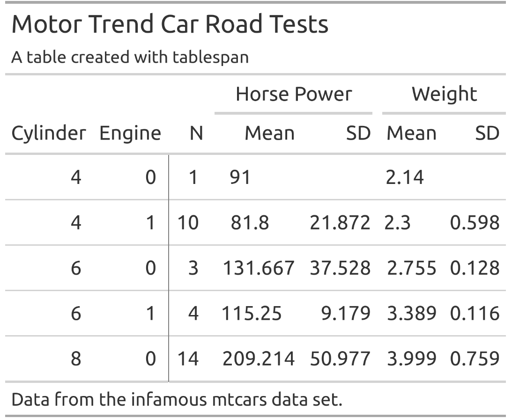
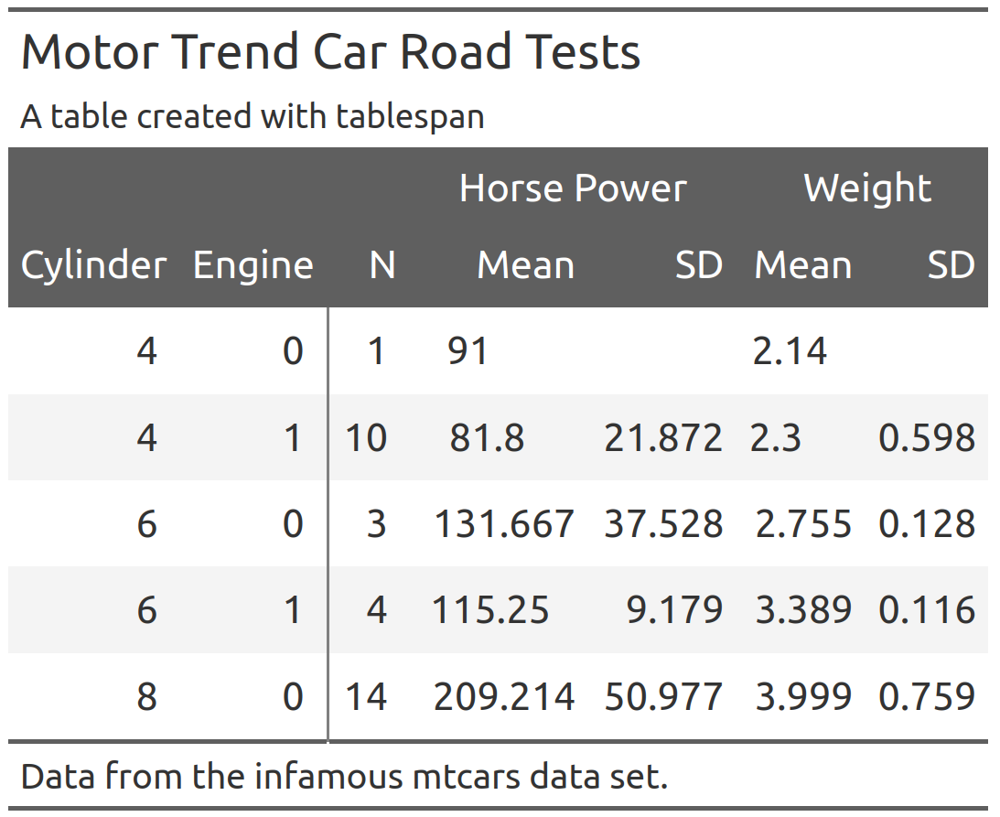
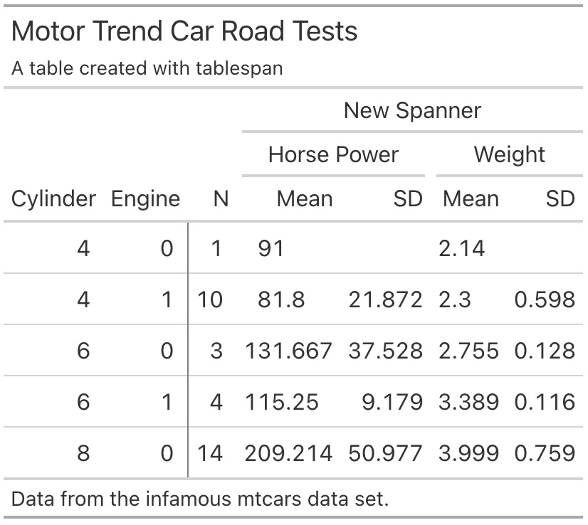

<!-- The README.md is generated automatically from README.qmd
&#10;To render the README.qmd file, the following actions are required:
&#10;- install quarto from https://quarto.org/docs/get-started/
- install R and the package reticulate
- install jupyter notebooks
- render the README.qmd
-->

# Tablespam - Simple Tables Made Simple

<!-- badges: start -->

[](https://lifecycle.r-lib.org/articles/stages.html#experimental)
<!-- badges: end -->

The objective of `tablespam` is to provide a “good enough” approach to
creating tables in python. `tablespam` is a port of the R package
[`tablespan`](https://jhorzek.github.io/tablespan/).

`tablespam` currently builds on the awesome package
[`great_tables`](https://posit-dev.github.io/great-tables/articles/intro.html),
which allows tables created with `tablespam` to be exported to the
following formats:

- **HTML** (using [`gt`](https://gt.rstudio.com/))
- **LaTeX** (using [`gt`](https://gt.rstudio.com/))
- **RTF** (using [`gt`](https://gt.rstudio.com/))

An export to Excel is still work in progress.

## Installation

`tablespam` is not yet available from pip. To install the development
version from GitHub, run:

    pip install git+https://github.com/jhorzek/tablespam.git#egg=tablespam

## Introduction

Python has a large set of great packages that allow you to create and
export tables that look exactly like you envisioned. However, sometimes
you may just need a good-enough table that is easy to create and share
with others. This is where `tablespam` can be of help.

Let’s assume that we want to share the following table:

``` python
import polars as pl

# Create data set inspired by the cars data in R:
cars = pl.DataFrame(
    {
        'mpg': [21.0, 21.0, 22.8, 21.4, 18.7, 18.1, 14.3, 24.4, 22.8, 19.2],
        'cyl': [6, 6, 4, 6, 8, 6, 8, 4, 4, 6],
        'disp': [160.0, 160.0, 108.0, 258.0, 360.0, 225.0, 360.0, 146.7, 140.8, 167.6],
        'hp': [110, 110, 93, 110, 175, 105, 245, 62, 95, 123],
        'drat': [3.90, 3.90, 3.85, 3.08, 3.15, 2.76, 3.21, 4.08, 3.92, 3.92],
        'wt': [2.620, 2.875, 2.320, 3.215, 3.440, 3.460, 3.570, 3.190, 3.150, 3.440],
        'qsec': [16.46, 17.02, 18.61, 19.44, 17.02, 20.22, 15.84, 20.00, 22.90, 18.30],
        'vs': [0, 0, 1, 1, 0, 1, 0, 1, 1, 1],
        'am': [1, 1, 1, 0, 0, 0, 0, 0, 0, 0],
        'gear': [4, 4, 4, 3, 3, 3, 3, 4, 4, 4],
        'carb': [4, 4, 1, 1, 2, 1, 4, 2, 2, 4],
    }
)

summarized_table = cars.group_by(['cyl', 'vs']).agg(
    [
        pl.len().alias('N'),
        pl.col('hp').mean().alias('mean_hp'),
        pl.col('hp').std().alias('sd_hp'),
        pl.col('wt').mean().alias('mean_wt'),
        pl.col('wt').std().alias('sd_wt'),
    ]
)

print(summarized_table)
```

    shape: (4, 7)
    ┌─────┬─────┬─────┬────────────┬───────────┬──────────┬──────────┐
    │ cyl ┆ vs  ┆ N   ┆ mean_hp    ┆ sd_hp     ┆ mean_wt  ┆ sd_wt    │
    │ --- ┆ --- ┆ --- ┆ ---        ┆ ---       ┆ ---      ┆ ---      │
    │ i64 ┆ i64 ┆ u32 ┆ f64        ┆ f64       ┆ f64      ┆ f64      │
    ╞═════╪═════╪═════╪════════════╪═══════════╪══════════╪══════════╡
    │ 6   ┆ 1   ┆ 3   ┆ 112.666667 ┆ 9.291573  ┆ 3.371667 ┆ 0.136045 │
    │ 6   ┆ 0   ┆ 2   ┆ 110.0      ┆ 0.0       ┆ 2.7475   ┆ 0.180312 │
    │ 4   ┆ 1   ┆ 3   ┆ 83.333333  ┆ 18.502252 ┆ 2.886667 ┆ 0.491155 │
    │ 8   ┆ 0   ┆ 2   ┆ 210.0      ┆ 49.497475 ┆ 3.505    ┆ 0.091924 │
    └─────┴─────┴─────┴────────────┴───────────┴──────────┴──────────┘

> Note: `tablespam` currently only supports `polars` data frames.

We don’t want to share the table as is - the variable names are all a
bit technical and the table could need some spanners summarizing
columns. So, we want to share a table that looks something like this:

    |                   | Horse Power |   Weight  |
    | Cylinder | Engine | Mean  |  SD | Mean | SD |
    | -------- | ------ | ----- | --- | ---- | -- |
    |                   |                         |

`tablespam` allows us to create this table with a single formula.

### Creating a Basic Table

In `tablespam`, the table headers are defined with a formula inspired by
R. For example, `"cyl ~ mean_hp + sd_hp"` defines a table with `cyl` as
the row names and `mean_hp` and `sd_hp` as columns:

``` python
from tablespam import TableSpam
tbl = TableSpam(data = summarized_table,
                formula = "cyl ~ mean_hp + sd_hp")
print(tbl.as_string())
```


    | cyl | mean_hp sd_hp |
    | --- - ------- ----- |
    | 6   | 112.67  9.29  |
    | 6   | 110.0   0.0   |
    | 4   | 83.33   18.5  |
    | ... | ...     ...   |

Note that the row names (`cyl`) are in a separate block to the left.

### Adding Spanners

Spanners are defined using braces and spanner names. For example, the
following defines a spanner for `mean_hp` and `sd_hp` with the name
`Horsepower`: `"cyl ~ (Horsepower = mean_hp + sd_hp)"`:

``` python
tbl = TableSpam(data = summarized_table,
                formula = "cyl ~ (Horsepower = mean_hp + sd_hp)")
print(tbl.as_string())
```


    |     | Horsepower       |
    | cyl | mean_hp    sd_hp |
    | --- - ---------- ----- |
    | 6   | 112.67     9.29  |
    | 6   | 110.0      0.0   |
    | 4   | 83.33      18.5  |
    | ... | ...        ...   |

Spanners can also be nested:

``` python
tbl = TableSpam(data = summarized_table,
                formula = "cyl ~ (Horsepower = (Mean = mean_hp) + (SD  = sd_hp))")
print(tbl.as_string())
```


    |     | Horsepower       |
    |     | Mean       SD    |
    | cyl | mean_hp    sd_hp |
    | --- - ---------- ----- |
    | 6   | 112.67     9.29  |
    | 6   | 110.0      0.0   |
    | 4   | 83.33      18.5  |
    | ... | ...        ...   |

### Renaming Columns

Variable names in an data frame are often very technical (e.g.,
`mean_hp` and `sd_hp`). When sharing the table, we may want to replace
those names. In the example above, we may want to replace `mean_hp` and
`sd_hp` with “Mean” and “SD”. In `tablespam` renaming variables is
achieved with `new_name:old_name`. For example,
`"cyl ~ (Horsepower = Mean:mean_hp + SD:sd_hp)"` renames `mean_hp` to
`Mean` and `sd_hp` to `SD`:

``` python
tbl = TableSpam(data = summarized_table,
                formula = "cyl ~ (Horsepower = Mean:mean_hp + SD:sd_hp)")
print(tbl.as_string())
```


    |     | Horsepower      |
    | cyl | Mean       SD   |
    | --- - ---------- ---- |
    | 6   | 112.67     9.29 |
    | 6   | 110.0      0.0  |
    | 4   | 83.33      18.5 |
    | ... | ...        ...  |

### Creating the Full Table

The combination of row names, spanners, and renaming of variables allows
creating the full table:

``` python
tbl = TableSpam(data = summarized_table,
                formula = """Cylinder:cyl + Engine:vs ~
                   N +
                   (`Horse Power` = Mean:mean_hp + SD:sd_hp) +
                   (`Weight` = Mean:mean_wt + SD:sd_wt)""",
                 title = "Motor Trend Car Road Tests",
                 subtitle = "A table created with tablespam",
                 footnote = "Data from the infamous mtcars data set.")
print(tbl.as_string())
```

    Motor Trend Car Road Tests
    A table created with tablespam

    |                 |     Horse Power      Weight      |
    | Cylinder Engine | N   Mean        SD   Mean   SD   |
    | -------- ------ - --- ----------- ---- ------ ---- |
    | 6        1      | 3   112.67      9.29 3.37   0.14 |
    | 6        0      | 2   110.0       0.0  2.75   0.18 |
    | 4        1      | 3   83.33       18.5 2.89   0.49 |
    | ...      ...    | ... ...         ...  ...    ...  |
    Data from the infamous mtcars data set.

## Exporting to Excel

Exporting to Excel is still work in progress.

## Exporting to HTML, LaTeX, and RTF

Tables created with `tablespam` can be exported to `great_tables` which
allows saving as HTML, LaTeX, or RTF file. To this end, we simply have
to call `as_gt` on our table:

``` python
# Translate to gt:
gt_tbl = tbl.as_gt()
```

``` python
gt_tbl.show()
```

<p align="center">


</p>

### Styling Great Tables

The `great_tables` package provides a wide range of functions to adapt
the style of the table created with `as_gt`. For instance, `opt_stylize`
adds a pre-defined style to the entire table:

``` python
(gt_tbl
  .opt_stylize(style = 6,
               color = 'gray')
  .show())
```

<p align="center">


</p>

When adapting the `great_tables` object, there is an important detail to
keep in mind: To ensure that each table spanner has a unique ID,
`tablespam` will create IDs that differ from the text shown in the
spanner. To demonstrate this, Let’s assume that we want to add a spanner
above `Horse Power` and `Weight`:

``` python
(gt_tbl
  .tab_spanner(label = "New Spanner", 
               spanners = ["Horse Power", "Weight"]))
```

    AssertionError: 
    ---------------------------------------------------------------------------
    AssertionError                            Traceback (most recent call last)
    Cell In[17], line 2
          1 (gt_tbl
    ----> 2   .tab_spanner(label = "New Spanner", 
          3                spanners = ["Horse Power", "Weight"]))

    File ~/Documents/Programming/Python/tablespam/.venv/lib/python3.13/site-packages/great_tables/_spanners.py:165, in tab_spanner(self, label, columns, spanners, level, id, gather, replace)
        161 # select spanner ids ----
        162 # TODO: this supports tidyselect
        163 # TODO: could we use something like resolve_vector_l
        164 if spanners is not None:
    --> 165     assert set(spanners).issubset(set(crnt_spanner_ids))
        166     spanner_ids = spanners
        167 else:

    AssertionError: 

This will throw an error because the spanner IDs are different from the
spanner labels.

In general, the ID of a spanner is given by a concatenation of
“**BASE_LEVEL**” and the names of all spanners above the current
spanner. For example, the IDs for Horse Power and Weight are
“\_\_BASE_LEVEL\_\_Horse Power” and “\_\_BASE_LEVEL\_\_Weight”:

``` python
(gt_tbl
  .tab_spanner(label = "New Spanner", 
                  spanners = ["__BASE_LEVEL__Horse Power", 
                               "__BASE_LEVEL__Weight"])
  .show())
```

<p align="center">


</p>

## Tables without row names

Using `1` on the left hand side of the formula creates a table without
row names. For example, `"1 ~ (Horsepower = Mean:mean_hp + SD:sd_hp)"`
defines

``` python
tbl = TableSpam(data = summarized_table,
                formula = "1 ~ (Horsepower = Mean:mean_hp + SD:sd_hp)")
print(tbl.as_string())
```


    | Horsepower      |
    | Mean       SD   |
    | ---------- ---- |
    | 112.67     9.29 |
    | 110.0      0.0  |
    | 83.33      18.5 |
    | ...        ...  |

## References

- gt: Iannone R, Cheng J, Schloerke B, Hughes E, Lauer A, Seo J,
  Brevoort K, Roy O (2024). gt: Easily Create Presentation-Ready Display
  Tables. R package version 0.11.1.9000,
  <https://github.com/rstudio/gt>, <https://gt.rstudio.com>.
- expss: Gregory D et al. (2024). expss: Tables with Labels in R. R
  package version 0.9.31, <https://gdemin.github.io/expss/>.
- tables: Murdoch D (2024). tables: Formula-Driven Table Generation. R
  package version 0.9.31, <https://dmurdoch.github.io/tables/>.
- openxlsx: Schauberger P, Walker A (2023). *openxlsx: Read, Write and
  Edit xlsx Files*. R package version 4.2.5.2,
  <https://ycphs.github.io/openxlsx/>.
