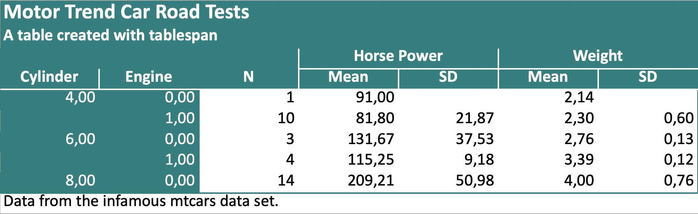
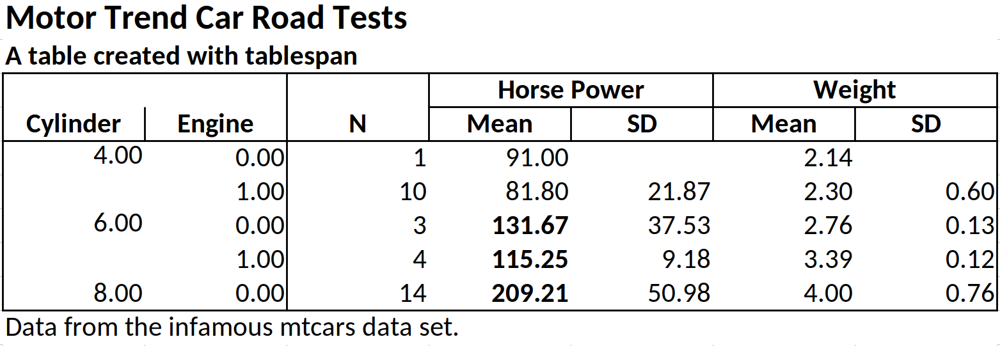
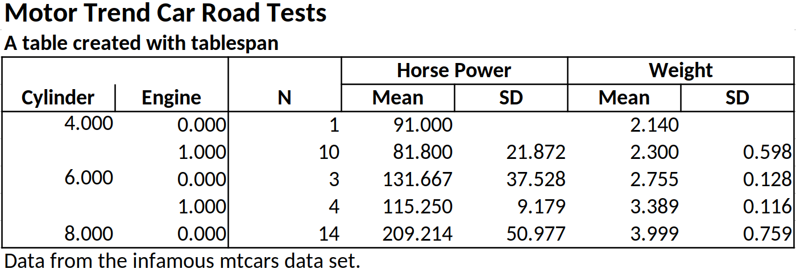

<!-- The README.md is generated automatically from README.qmd
&#10;To render the README.qmd file, the following actions are required:
&#10;- install quarto from https://quarto.org/docs/get-started/
- install R and the package reticulate
- install jupyter notebooks
- render the README.qmd
-->

# Tablespam - Simple Tables Made Simple

<!-- badges: start -->

[](https://lifecycle.r-lib.org/articles/stages.html#experimental)
<!-- badges: end -->

The objective of `tablespam` is to provide a “good enough” approach to
creating tables in python. `tablespam` is a port of the R package
[`tablespan`](https://jhorzek.github.io/tablespan/).

`tablespam` currently builds on the awesome package
[`great_tables`](https://posit-dev.github.io/great-tables/articles/intro.html),
which allows tables created with `tablespam` to be exported to the
following formats:

- **Excel** (using
  [`openpyxl`](https://openpyxl.readthedocs.io/en/stable/))
- **HTML** (using
  [`great_tables`](https://posit-dev.github.io/great-tables/articles/intro.html))
- **LaTeX** (using
  [`great_tables`](https://posit-dev.github.io/great-tables/articles/intro.html))
- **RTF** (using
  [`great_tables`](https://posit-dev.github.io/great-tables/articles/intro.html))

## Installation

`tablespam` is available from pip:

    pip install tablespam

To install the development version from GitHub, run:

    pip install git+https://github.com/jhorzek/tablespam.git#egg=tablespam

## Introduction

Python has a large set of great packages that allow you to create and
export tables that look exactly like you envisioned. However, sometimes
you may just need a good-enough table that is easy to create and share
with others. This is where `tablespam` can be of help.

Let’s assume that we want to share the following table:

``` python
import polars as pl
>>> from tablespam.Data.mtcars import mtcars

# Import mtcars data from R:
cars = mtcars()

summarized_table = cars.group_by(['cyl', 'vs'], 
                                  maintain_order=True).agg(
    [
        pl.len().alias('N'),
        pl.col('hp').mean().alias('mean_hp'),
        pl.col('hp').std().alias('sd_hp'),
        pl.col('wt').mean().alias('mean_wt'),
        pl.col('wt').std().alias('sd_wt'),
    ]
)

print(summarized_table)
```

    shape: (5, 7)
    ┌─────┬─────┬─────┬────────────┬───────────┬──────────┬──────────┐
    │ cyl ┆ vs  ┆ N   ┆ mean_hp    ┆ sd_hp     ┆ mean_wt  ┆ sd_wt    │
    │ --- ┆ --- ┆ --- ┆ ---        ┆ ---       ┆ ---      ┆ ---      │
    │ i64 ┆ i64 ┆ u32 ┆ f64        ┆ f64       ┆ f64      ┆ f64      │
    ╞═════╪═════╪═════╪════════════╪═══════════╪══════════╪══════════╡
    │ 6   ┆ 0   ┆ 3   ┆ 131.666667 ┆ 37.527767 ┆ 2.755    ┆ 0.12816  │
    │ 4   ┆ 1   ┆ 10  ┆ 81.8       ┆ 21.872357 ┆ 2.3003   ┆ 0.598207 │
    │ 6   ┆ 1   ┆ 4   ┆ 115.25     ┆ 9.17878   ┆ 3.38875  ┆ 0.116216 │
    │ 8   ┆ 0   ┆ 14  ┆ 209.214286 ┆ 50.976886 ┆ 3.999214 ┆ 0.759405 │
    │ 4   ┆ 0   ┆ 1   ┆ 91.0       ┆ null      ┆ 2.14     ┆ null     │
    └─────┴─────┴─────┴────────────┴───────────┴──────────┴──────────┘

> Note: `tablespam` currently only supports `polars` data frames.

We don’t want to share the table as is - the variable names are all a
bit technical and the table could need some spanners summarizing
columns. So, we want to share a table that looks something like this:

    |                   | Horse Power |   Weight  |
    | Cylinder | Engine | Mean  |  SD | Mean | SD |
    | -------- | ------ | ----- | --- | ---- | -- |
    |                   |                         |

`tablespam` allows us to create this table with a single formula.

### Creating a Basic Table

In `tablespam`, the table headers are defined with a formula inspired by
R. For example, `"cyl ~ mean_hp + sd_hp"` defines a table with `cyl` as
the row names and `mean_hp` and `sd_hp` as columns:

``` python
from tablespam import TableSpam
tbl = TableSpam(data = summarized_table,
                formula = "cyl ~ mean_hp + sd_hp")
print(tbl.as_string())
```


    | cyl | mean_hp sd_hp |
    | --- - ------- ----- |
    | 6   | 131.67  37.53 |
    | 4   | 81.8    21.87 |
    | 6   | 115.25  9.18  |
    | ... | ...     ...   |

Note that the row names (`cyl`) are in a separate block to the left.

### Adding Spanners

Spanners are defined using braces and spanner names. For example, the
following defines a spanner for `mean_hp` and `sd_hp` with the name
`Horsepower`: `"cyl ~ (Horsepower = mean_hp + sd_hp)"`:

``` python
tbl = TableSpam(data = summarized_table,
                formula = "cyl ~ (Horsepower = mean_hp + sd_hp)")
print(tbl.as_string())
```


    |     | Horsepower       |
    | cyl | mean_hp    sd_hp |
    | --- - ---------- ----- |
    | 6   | 131.67     37.53 |
    | 4   | 81.8       21.87 |
    | 6   | 115.25     9.18  |
    | ... | ...        ...   |

Spanners can also be nested:

``` python
tbl = TableSpam(data = summarized_table,
                formula = "cyl ~ (Horsepower = (Mean = mean_hp) + (SD  = sd_hp))")
print(tbl.as_string())
```


    |     | Horsepower       |
    |     | Mean       SD    |
    | cyl | mean_hp    sd_hp |
    | --- - ---------- ----- |
    | 6   | 131.67     37.53 |
    | 4   | 81.8       21.87 |
    | 6   | 115.25     9.18  |
    | ... | ...        ...   |

### Renaming Columns

Variable names in an data frame are often very technical (e.g.,
`mean_hp` and `sd_hp`). When sharing the table, we may want to replace
those names. In the example above, we may want to replace `mean_hp` and
`sd_hp` with “Mean” and “SD”. In `tablespam` renaming variables is
achieved with `new_name:old_name`. For example,
`"cyl ~ (Horsepower = Mean:mean_hp + SD:sd_hp)"` renames `mean_hp` to
`Mean` and `sd_hp` to `SD`:

``` python
tbl = TableSpam(data = summarized_table,
                formula = "cyl ~ (Horsepower = Mean:mean_hp + SD:sd_hp)")
print(tbl.as_string())
```


    |     | Horsepower       |
    | cyl | Mean       SD    |
    | --- - ---------- ----- |
    | 6   | 131.67     37.53 |
    | 4   | 81.8       21.87 |
    | 6   | 115.25     9.18  |
    | ... | ...        ...   |

### Creating the Full Table

The combination of row names, spanners, and renaming of variables allows
creating the full table:

``` python
tbl = TableSpam(data = summarized_table,
                formula = """Cylinder:cyl + Engine:vs ~
                   N +
                   (`Horse Power` = Mean:mean_hp + SD:sd_hp) +
                   (`Weight` = Mean:mean_wt + SD:sd_wt)""",
                 title = "Motor Trend Car Road Tests",
                 subtitle = "A table created with tablespam",
                 footnote = "Data from the infamous mtcars data set.")
print(tbl.as_string())
```

    Motor Trend Car Road Tests
    A table created with tablespam

    |                 |     Horse Power       Weight      |
    | Cylinder Engine | N   Mean        SD    Mean   SD   |
    | -------- ------ - --- ----------- ----- ------ ---- |
    | 6        0      | 3   131.67      37.53 2.76   0.13 |
    | 4        1      | 10  81.8        21.87 2.3    0.6  |
    | 6        1      | 4   115.25      9.18  3.39   0.12 |
    | ...      ...    | ... ...         ...   ...    ...  |
    Data from the infamous mtcars data set.

## Exporting to Excel

> Note: The screenshots below are from the R-package tablespan and may
> deviate slightly from the actual output. The screenshots will be
> updated soon.

Tables created with `tablespam` can be exported to `openpyxl` workbooks,
which allows saving as .xlsx files.

``` python
# Translate to openpyxl:
tbl_xlsx = tbl.as_excel()

# save the table:
# tbl_xlsx.save("my_table.xlsx")
```


### Styling

While `tablespam` provides limited styling options, some elements can be
adjusted. For example, we may want to print some elements in bold or
format numbers differently. In `tablespam`, styling happens when
translating the table to an `openpyxl` workbook with `as_excel`.

#### Changing the Overall Look

The easiest way to customize tables is to change the default color
scheme. The class `XlsxStyles` provides control over most elements in
the table, but in many cases `style_color` may be sufficient. The
following creates a table with teal-colored backgrounds for the title,
header, and row names:

``` python
from tablespam.Excel.xlsx_styles import style_color

tbl_xlsx = tbl.as_excel(styles = style_color(primary_color = "008080"))

# save the table:
# tbl_xlsx.save("my_table.xlsx")
```



Similarly, a dark background can be defined as follows:

``` python
tbl_xlsx = tbl.as_excel(styles = style_color(primary_color = "000000"))

# save the table:
# tbl_xlsx.save("my_table.xlsx")
```

#### Formatting Cells

Let’s assume we want all `mean_hp` values with a value $\geq 100$ to be
printed in bold. To this end, we first create a function that takes in a
single openpyxl cell and applies a style to it:

``` python
import openpyxl
def bold(c):
    c.font = openpyxl.styles.Font(bold=True)
```

Next, we have to define a CellStyle for the column `mean_hp`, where we
pass in the index of the rows that should be bold.

> Note: openpyxl uses 1-based indexing!

``` python
# get the indices:
geq_100 = (summarized_table.with_row_index(name="index") 
            .filter(pl.col("mean_hp") >= 100) 
            .select("index") 
            .to_series() 
            .to_list())
# translate to 1-based index:
geq_100 = [i + 1 for i in geq_100]
```

Define cell styles:

``` python
from tablespam.Excel.xlsx_styles import XlsxStyles, CellStyle
styles=XlsxStyles(
            cell_styles=[
                CellStyle(
                    rows=geq_100,
                    cols=['mean_hp'],
                    style=bold,
                ),
            ]
        )
```

Finally, we pass this style to `as_excel`:

``` python
tbl_xlsx = tbl.as_excel(styles=styles)

# save the table:
# tbl_xlsx.save("my_table.xlsx")
```



#### Formatting Data Types

`tablespan` also allows formatting specific data types. Let’s assume
that we want to round all doubles to 3 instead of the default 2 digits.
To this end, we use `DataStyle`s, where we specify (1) a function that
checks for the data type we want to style (here for doubles) and (2) a
style for all columns that match that style:

``` python
from tablespam.Excel.xlsx_styles import DataStyle
# Define test: The function will be passed a polars data frame and should
# check for the data types defined here: 
# https://docs.pola.rs/api/python/stable/reference/datatypes.html
def is_double(x: pl.DataFrame) -> bool:
    return all([tp in [pl.Float32, pl.Float64] for tp in x.dtypes])

# Function that applies our style to a single cell:
def three_digits(c):
    c.number_format = "0.000"

# Now we define the data_style. The data_style must be a 
# dict.
data_style = {
    "double": DataStyle(test = is_double,
                         style = three_digits) 
} 
tbl_xlsx = tbl.as_excel(
        styles=XlsxStyles(
            data_styles=data_style
        )
    )
# tbl_xlsx.save("my_table.xlsx")
```



## Exporting to HTML, LaTeX, and RTF

Tables created with `tablespam` can be exported to `great_tables` which
allows saving as HTML, LaTeX, or RTF file. To this end, we simply have
to call `as_gt` on our table:

``` python
# Translate to gt:
gt_tbl = tbl.as_gt()
```

``` python
gt_tbl.show()
```

<p align="center">


</p>

### Styling Great Tables

The `great_tables` package provides a wide range of functions to adapt
the style of the table created with `as_gt`. For instance, `opt_stylize`
adds a pre-defined style to the entire table:

``` python
(gt_tbl
  .opt_stylize(style = 6,
               color = 'gray')
  .show())
```

<p align="center">


</p>

When adapting the `great_tables` object, there is an important detail to
keep in mind: To ensure that each table spanner has a unique ID,
`tablespam` will create IDs that differ from the text shown in the
spanner. To demonstrate this, Let’s assume that we want to add a spanner
above `Horse Power` and `Weight`:

``` python
(gt_tbl
  .tab_spanner(label = "New Spanner", 
               spanners = ["Horse Power", "Weight"]))
```

    AssertionError: 
    ---------------------------------------------------------------------------
    AssertionError                            Traceback (most recent call last)
    Cell In[33], line 2
          1 (gt_tbl
    ----> 2   .tab_spanner(label = "New Spanner", 
          3                spanners = ["Horse Power", "Weight"]))

    File ~/Documents/Programming/Python/tablespam/.venv/lib/python3.13/site-packages/great_tables/_spanners.py:165, in tab_spanner(self, label, columns, spanners, level, id, gather, replace)
        161 # select spanner ids ----
        162 # TODO: this supports tidyselect
        163 # TODO: could we use something like resolve_vector_l
        164 if spanners is not None:
    --> 165     assert set(spanners).issubset(set(crnt_spanner_ids))
        166     spanner_ids = spanners
        167 else:

    AssertionError: 

This will throw an error because the spanner IDs are different from the
spanner labels.

In general, the ID of a spanner is given by a concatenation of
“**BASE_LEVEL**” and the names of all spanners above the current
spanner. For example, the IDs for Horse Power and Weight are
“\_\_BASE_LEVEL\_\_Horse Power” and “\_\_BASE_LEVEL\_\_Weight”:

``` python
(gt_tbl
  .tab_spanner(label = "New Spanner", 
                  spanners = ["__BASE_LEVEL__Horse Power", 
                               "__BASE_LEVEL__Weight"])
  .show())
```

<p align="center">


</p>

## Tables without row names

Using `1` on the left hand side of the formula creates a table without
row names. For example, `"1 ~ (Horsepower = Mean:mean_hp + SD:sd_hp)"`
defines

``` python
tbl = TableSpam(data = summarized_table,
                formula = "1 ~ (Horsepower = Mean:mean_hp + SD:sd_hp)")
print(tbl.as_string())
```


    | Horsepower       |
    | Mean       SD    |
    | ---------- ----- |
    | 131.67     37.53 |
    | 81.8       21.87 |
    | 115.25     9.18  |
    | ...        ...   |

## References

- great_tables: Iannone R., et al.,
  https://posit-dev.github.io/great-tables/articles/intro.html
- tables: Murdoch D (2024). tables: Formula-Driven Table Generation. R
  package version 0.9.31, <https://dmurdoch.github.io/tables/>.
- openpyxl: Gazoni, E. & Clark C.,
  https://openpyxl.readthedocs.io/en/stable/
